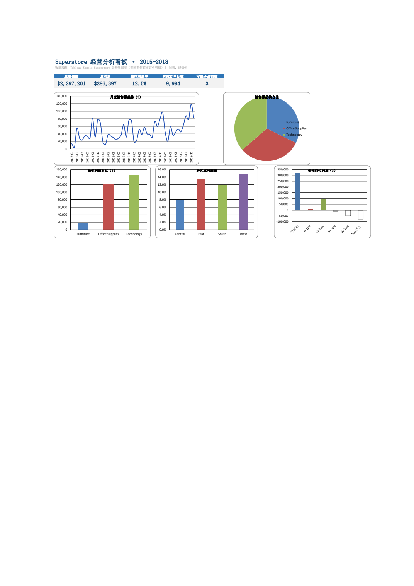
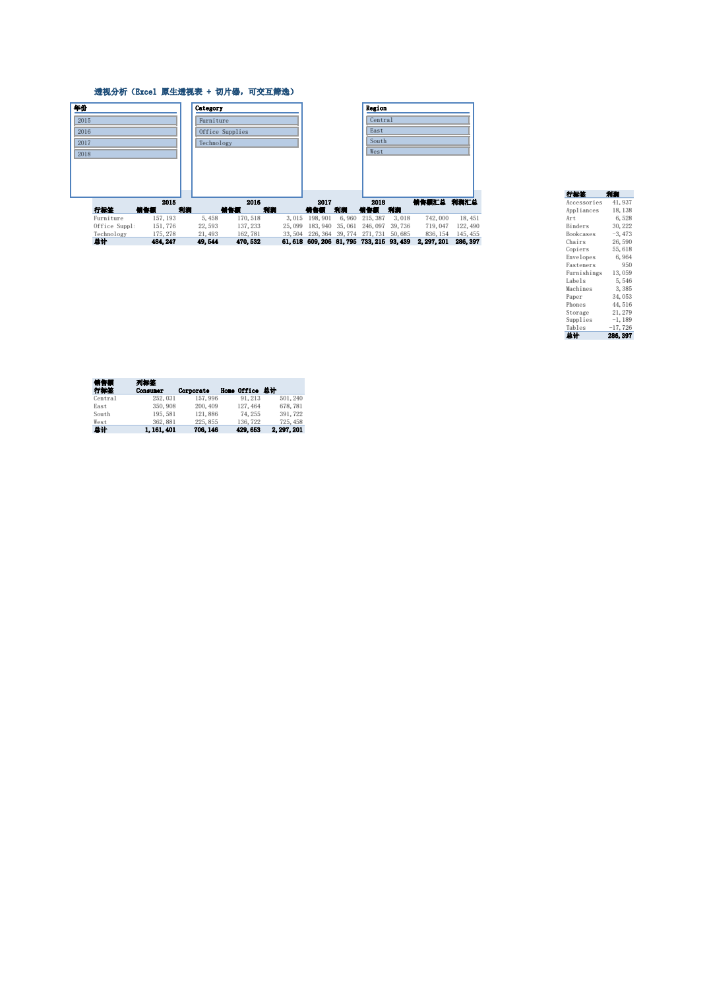

# Superstore 零售超市经营分析（Excel）

> 纯 Excel 完成的经营分析小项目：数据清洗 → 透视表/切片器交互分析 → SUMIFS 汇总 → 可视化看板 → 业务建议。



## 项目背景

基于 Tableau 官方公开的 **Sample Superstore** 数据集（美国零售超市订单明细，2015–2018 年），以"经营分析复盘"为目标，回答三个问题：

1. 整体经营是否健康？
2. 哪些品类 / 区域在拖累利润？
3. 折扣策略对利润的影响有多大？

## 数据说明与清洗

- 数据来源：[Tableau Sample Superstore（leonism/sample-superstore）](https://github.com/leonism/sample-superstore)
- 原始数据 10,800 行，清洗后 **9,994 行**有效订单明细：
  - 剔除空白 / 无效行 806 行
  - 日期字段规范化为标准日期格式，并按订单日期排序
  - 用公式添加辅助列：`年份 =YEAR()`、`月份 =TEXT()`、`折扣档 =IF()` 六档分箱

## 分析框架与工具

| 模块 | 实现方式 |
|---|---|
| 多维汇总 | `SUMIFS` / `COUNTIF` 公式驱动（月度、品类、区域、折扣档、子品类） |
| 交互分析 | Excel 原生**透视表** × 3（品类×年份、子品类利润、区域×客群），配**切片器**（年份 / 品类 / 区域）联动筛选 |
| 可视化看板 | KPI 卡片 + 5 张图表（月度趋势、品类占比、品类利润、区域利润率、折扣档利润），条件格式数据条与色阶 |
| 结论输出 | 分析结论表，发现 → 建议逐条对应 |

## 核心发现

- **整体健康**：累计销售额 $2.30M，利润 $286K，利润率 12.5%；销售额四年增长 51%（$484K → $733K），利润增长 89%。
- **家具类规模不盈利**：Furniture 利润率仅 2.5%，远低于 Office Supplies（17.0%）与 Technology（17.4%）；子品类 **Tables 销售额 $207K 却亏损 $17.7K**，Bookcases 亏损 $3.5K。
- **折扣是利润杀手**：无折扣订单利润率 29.5%；折扣超 20% 的订单整体亏损；50% 以上折扣订单利润率 **-119%**。
- **区域分化**：Central 区域利润率 7.9%，显著低于 West（14.9%）。

## 业务建议

1. 建立折扣分级审批机制：>20% 折扣需上级审批，砍掉 >50% 的清仓式折扣；
2. 对 Tables / Bookcases 启动定价与供应商成本复盘，扭亏前控制促销资源投放；
3. 对 Central 区域做专项诊断（对标 West 的品类结构与折扣水平），利润率目标对齐 12%。

## 文件结构

```
├── superstore_analysis.xlsx   # 主交付物（封面 / 经营看板 / 订单明细 / 汇总数据 / 透视分析 / 分析结论）
├── data/superstore.csv        # 原始数据
└── images/                    # 看板与透视表预览图
```

## 使用说明

用 Excel（2016 及以上）打开 `superstore_analysis.xlsx`：

- **经营看板**：核心 KPI 与图表一览；
- **透视分析**：点击切片器（年份 / 品类 / Region）即可联动筛选三张透视表；



- **订单明细**：清洗后的明细数据，辅助列均为活公式，可自行扩展分析。
